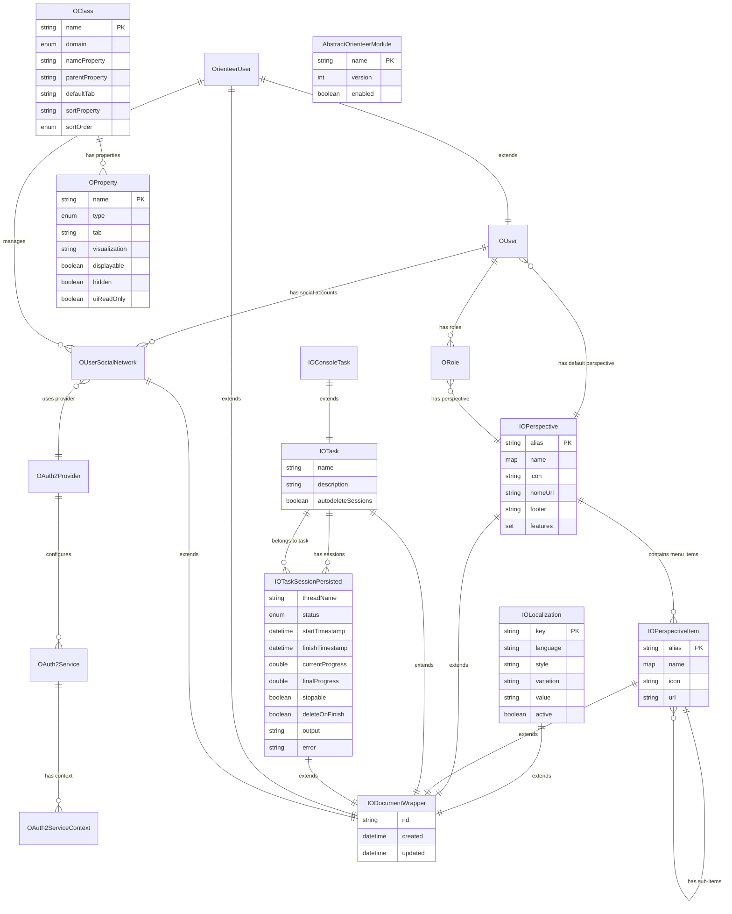
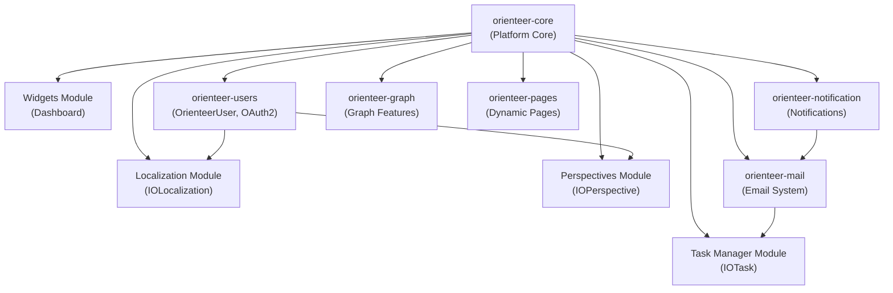
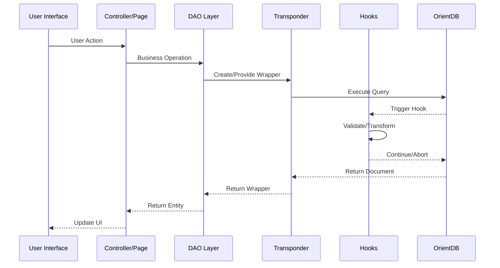
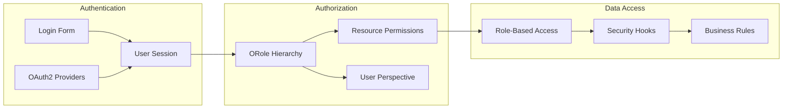

# Orienteer Business Domain Entity Relationship Diagram

## Core Entity Relationships



## Module Dependencies



## Data Flow Architecture



## Key Design Patterns

### 1. Entity Definition Pattern
```java
@EntityType(IOLocalization.CLASS_NAME)
@OrienteerOClass(nameProperty = "key")
public interface IOLocalization extends IODocumentWrapper {
    // Property definitions with annotations
}
```

### 2. Hook-Based Business Logic
```java
public class ValidationHook extends ODocumentHookAbstract {
    @Override
    public void onRecordBeforeCreate(ODocument doc) {
        // Validation logic
    }
}
```

### 3. Method Exposure Pattern
```java
@OMethod(icon = FAIconType.play, bootstrap = BootstrapType.SUCCESS)
public default void startTask(IMethodContext ctx) {
    // Business logic
}
```

## Security Architecture



## Business Process Flows

### User Registration & Authentication
1. **Registration**: Create OrienteerUser with email validation
2. **OAuth2 Integration**: Link social network accounts
3. **Role Assignment**: Assign default roles and perspective
4. **Session Management**: Track user activity and preferences

### Content Localization
1. **Key Registration**: Auto-create localization entries
2. **Content Translation**: Manage multi-language content
3. **Cache Management**: Invalidate cache on content changes
4. **Best Match Selection**: Score-based algorithm for content selection

### Task Execution
1. **Task Definition**: Create IOTask with parameters
2. **Session Creation**: Start IOTaskSessionPersisted
3. **Progress Tracking**: Update progress and output
4. **Completion Handling**: Cleanup and notifications

This entity relationship model demonstrates Orienteer's comprehensive approach to business application development, with strong emphasis on:
- **Modularity**: Clean separation of concerns
- **Extensibility**: Plugin-based architecture
- **Security**: Role-based access control
- **Internationalization**: Built-in localization support
- **User Experience**: Customizable perspectives and workflows