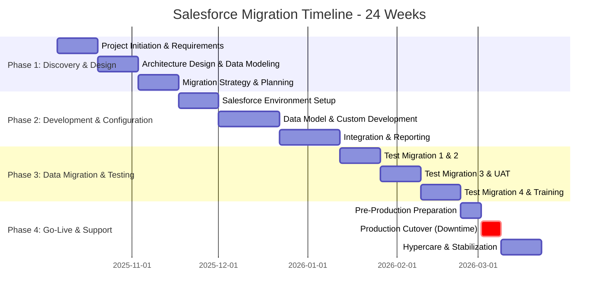

# Salesforce Migration Plan - Orienteer to Salesforce SaaS

**Document Version:** 1.0
**Date:** October 1, 2025
**Project:** Orienteer to Salesforce One-Time Migration
**Document Owner:** Migration Planning Team

---

## Executive Summary

This comprehensive migration plan details the strategy, timeline, and deliverables for migrating the Orienteer Business Application Platform to Salesforce SaaS. This is a **one-time, big-bang migration** with expected downtime, designed to transform the current on-premises Orienteer system (<500MB database) into a modern, cloud-native Salesforce implementation.

**Key Migration Parameters:**
- **Migration Type:** One-time, big-bang migration with downtime window
- **Database Size:** <500MB (OrientDB)
- **Target Environment:** Clean Salesforce instance (no existing data)
- **Test Migrations:** Multiple test migrations required for user validation
- **Timeline:** 20-24 weeks (5-6 months)
- **Downtime Window:** 48-72 hours for final cutover

---

## Migration Phases Overview

| **Phase** | **Duration** | **Key Focus** | **Success Criteria** |
|-----------|-------------|---------------|---------------------|
| **Phase 1: Discovery & Design** | Weeks 1-6 | Requirements, architecture, data mapping | Approved design documents, mapped data schema |
| **Phase 2: Development & Configuration** | Weeks 7-14 | Salesforce setup, custom development | Working Salesforce environment with core features |
| **Phase 3: Data Migration & Testing** | Weeks 15-20 | ETL execution, validation, UAT | Successful test migration, user acceptance |
| **Phase 4: Go-Live & Support** | Weeks 21-24 | Production cutover, stabilization | System live, <2% error rate, users trained |

---

## Phase 1: Discovery & Design (Weeks 1-6)

### Objectives
- Complete requirements analysis and gap assessment
- Design Salesforce data model and architecture
- Create comprehensive data mapping strategy
- Establish project governance and team structure

### Week 1-2: Project Initiation & Requirements Analysis

#### Deliverables
1. **Project Charter**
   - Executive sponsorship confirmation
   - Project scope and boundaries
   - Success criteria and KPIs
   - Budget and resource allocation
   - Risk register initialization

2. **Current State Assessment**
   - OrientDB schema documentation (all classes, properties, relationships)
   - Data volume analysis by entity type
   - Integration points inventory
   - Custom module functionality catalog
   - User role and permission mapping

3. **Requirements Documentation**
   - Functional requirements specification
   - Non-functional requirements (performance, security, scalability)
   - Integration requirements
   - Reporting and analytics requirements
   - User experience requirements

#### Activities
- [ ] Conduct stakeholder interviews (5-10 key stakeholders)
- [ ] Review existing Orienteer documentation and codebase
- [ ] Extract OrientDB schema definitions and relationships
- [ ] Document current business processes and workflows
- [ ] Identify critical vs. non-critical functionality
- [ ] Establish project communication plan and cadence

#### Success Metrics
- 100% of OrientDB classes documented
- All stakeholder requirements captured
- Project charter signed by executive sponsor
- Team roles and responsibilities defined

### Week 3-4: Architecture Design & Data Modeling

#### Deliverables
1. **Salesforce Architecture Design Document**
   - Org strategy (single org vs. multiple sandboxes)
   - Data model design (custom objects, relationships)
   - Security architecture (profiles, roles, permission sets)
   - Integration architecture (APIs, middleware, connectors)
   - Lightning page layouts and UI design

2. **Data Mapping Specification**
   - OrientDB class → Salesforce object mapping
   - Field-level mapping with data type transformations
   - Relationship mapping (master-detail, lookup, junction objects)
   - Data validation rules and constraints
   - Picklist value mappings

3. **Gap Analysis Document**
   - Feature gaps between Orienteer and Salesforce
   - Workaround strategies for unsupported features
   - Custom development requirements
   - Third-party app requirements (AppExchange)
   - Risk assessment for each gap

#### Activities
- [ ] Design Salesforce custom object model
- [ ] Map OrientDB relationships to Salesforce relationships
- [ ] Design Lightning application structure
- [ ] Create security model (profiles, permission sets, sharing rules)
- [ ] Identify AppExchange apps for missing functionality
- [ ] Design integration architecture for external systems
- [ ] Create UI/UX mockups for key screens

#### Success Metrics
- Complete data model with all entities mapped
- Architecture design approved by technical leadership
- Security model validated by security team
- Zero critical feature gaps without mitigation strategy

### Week 5-6: Migration Strategy & Planning

#### Deliverables
1. **Data Migration Strategy Document**
   - ETL tool selection (Salesforce Data Loader, Informatica, or MuleSoft)
   - Data extraction methodology from OrientDB
   - Data transformation rules and logic
   - Data validation and quality assurance procedures
   - Migration sequencing (order of entity migration)
   - Test migration schedule (3-4 test runs)

2. **Test Migration Plan**
   - Test migration #1: Core entities only (10% data)
   - Test migration #2: All entities (25% data)
   - Test migration #3: Full data with integrations (100% data)
   - Test migration #4: Dress rehearsal with cutover procedures
   - Success criteria for each test migration

3. **Cutover Plan**
   - Pre-cutover activities and checklist
   - Downtime window schedule (48-72 hours)
   - Migration execution runbook
   - Rollback procedures and criteria
   - Post-cutover validation checklist
   - Communication plan for users

4. **Training Plan**
   - Administrator training curriculum
   - End-user training by role
   - Training materials development schedule
   - Training delivery schedule
   - User adoption strategy

#### Activities
- [ ] Select and configure ETL tools
- [ ] Develop data extraction scripts from OrientDB
- [ ] Create data transformation logic
- [ ] Design data validation framework
- [ ] Document migration sequence and dependencies
- [ ] Create detailed cutover runbook
- [ ] Develop training curriculum and materials
- [ ] Schedule test migrations with users

#### Success Metrics
- ETL tools configured and tested
- Migration strategy approved by project team
- Test migration schedule agreed with stakeholders
- Training materials ready for pilot users

### Phase 1: Key Milestones

| **Milestone** | **Target Week** | **Deliverable** | **Approval Required** |
|--------------|----------------|-----------------|----------------------|
| **Project Kickoff** | Week 1 | Project Charter | Executive Sponsor |
| **Requirements Complete** | Week 2 | Requirements Document | Business Stakeholders |
| **Architecture Approved** | Week 4 | Architecture Design | Technical Leadership |
| **Migration Strategy Approved** | Week 6 | Migration Strategy | Project Steering Committee |

### Phase 1: Risks & Mitigation

| **Risk** | **Impact** | **Probability** | **Mitigation Strategy** |
|----------|-----------|----------------|------------------------|
| **Incomplete OrientDB documentation** | High | Medium | Conduct database schema analysis, reverse engineer if needed |
| **Stakeholder availability** | Medium | High | Schedule interviews early, use asynchronous methods |
| **Complex data relationships** | High | Medium | Engage Salesforce architect, plan for custom development |
| **Scope creep** | High | Medium | Strict change control process, phase 2 enhancements |

---

## Phase 2: Development & Configuration (Weeks 7-14)

### Objectives
- Build Salesforce environment based on approved design
- Configure custom objects, fields, and relationships
- Develop custom Lightning components and workflows
- Set up integrations with external systems
- Prepare for test data migrations

### Week 7-8: Salesforce Environment Setup

#### Deliverables
1. **Salesforce Org Configuration**
   - Production org provisioned
   - Developer sandbox created
   - Full copy sandbox for UAT created
   - Partial copy sandbox for testing created
   - Source control repository established (Git)

2. **Base Configuration**
   - Company information and branding
   - Email templates and letterheads
   - Lightning app setup
   - Navigation menus and tabs
   - Home page layouts

3. **Security Implementation**
   - Profiles created (5-10 user types)
   - Permission sets designed (15-20 permission sets)
   - Sharing rules configured
   - Field-level security applied
   - IP restrictions (if applicable)

#### Activities
- [ ] Provision Salesforce production and sandbox orgs
- [ ] Configure company settings and branding
- [ ] Create user profiles based on role mapping
- [ ] Set up permission sets for granular access
- [ ] Configure sharing model (OWD, sharing rules)
- [ ] Establish deployment pipeline (CI/CD)
- [ ] Set up version control for metadata

#### Success Metrics
- All Salesforce orgs provisioned and accessible
- Security model implemented and tested
- Deployment pipeline operational
- Version control repository established

### Week 9-11: Data Model & Custom Development

#### Deliverables
1. **Custom Objects Implementation**
   - All custom objects created (20-50 objects)
   - Custom fields defined (500+ fields)
   - Relationships established (master-detail, lookup, junction)
   - Validation rules configured (100+ rules)
   - Formula fields created

2. **Business Logic Development**
   - Apex triggers for complex business rules (10-20 triggers)
   - Apex classes for reusable logic (20-30 classes)
   - Workflow rules and process builders (15-25 processes)
   - Flow automation (10-15 flows)
   - Approval processes (5-10 processes)

3. **Lightning Component Development**
   - Custom Lightning Web Components (10-15 components)
   - Lightning pages for record types (20-30 pages)
   - Lightning app pages (5-10 apps)
   - Custom actions and buttons
   - Dynamic forms and layouts

#### Activities
- [ ] Create all custom objects and fields
- [ ] Implement validation rules and formulas
- [ ] Develop Apex triggers and classes
- [ ] Build Flow automations for workflows
- [ ] Create Lightning Web Components
- [ ] Configure Lightning pages and apps
- [ ] Implement approval processes
- [ ] Unit test all custom code (75%+ code coverage)

#### Success Metrics
- 100% of data model implemented
- All business logic migrated and functional
- Code coverage >75% for Apex code
- Lightning pages responsive and functional

### Week 12-14: Integration & Reporting

#### Deliverables
1. **Integration Implementation**
   - REST/SOAP API endpoints configured
   - External system connectors (email, SMS, etc.)
   - Single Sign-On (SSO) integration
   - Middleware configuration (MuleSoft/Informatica if used)
   - API authentication and security

2. **Reporting & Analytics**
   - Standard reports created (30-50 reports)
   - Custom report types designed (10-15 types)
   - Dashboards configured (10-15 dashboards)
   - Einstein Analytics setup (if applicable)
   - Scheduled reports and distribution lists

3. **Documentation**
   - Technical design documentation
   - Administrator guide
   - Developer documentation (Apex, LWC)
   - API documentation
   - Configuration change log

#### Activities
- [ ] Configure API integrations with external systems
- [ ] Set up SSO with identity provider
- [ ] Develop REST/SOAP APIs for integrations
- [ ] Create standard reports for all entities
- [ ] Build executive dashboards
- [ ] Configure scheduled reports
- [ ] Document all configurations and customizations
- [ ] Conduct peer code reviews

#### Success Metrics
- All integrations functional and tested
- Reports and dashboards meet requirements
- Complete technical documentation
- API endpoints secured and tested

### Phase 2: Key Milestones

| **Milestone** | **Target Week** | **Deliverable** | **Approval Required** |
|--------------|----------------|-----------------|----------------------|
| **Sandbox Ready** | Week 8 | Configured Sandbox | Technical Team |
| **Data Model Complete** | Week 11 | All Objects & Fields | Data Architect |
| **Custom Dev Complete** | Week 12 | Apex, LWC, Flows | Development Team Lead |
| **Dev Environment Ready** | Week 14 | Fully Configured System | Project Manager |

### Phase 2: Risks & Mitigation

| **Risk** | **Impact** | **Probability** | **Mitigation Strategy** |
|----------|-----------|----------------|------------------------|
| **Development delays** | High | Medium | Prioritize core features, buffer time in schedule |
| **Complex custom code** | High | Medium | Engage Salesforce developers early, code reviews |
| **Integration failures** | High | Low | Test integrations early, use sandbox environments |
| **Governor limit issues** | Medium | Medium | Design for bulk operations, optimize queries |

---

## Phase 3: Data Migration & Testing (Weeks 15-20)

### Objectives
- Execute multiple test data migrations
- Validate data integrity and accuracy
- Conduct comprehensive testing (UAT, integration, performance)
- Refine migration procedures for production cutover
- Train users on new system

### Week 15-16: Test Migration #1 & #2

#### Test Migration #1: Core Entities (10% Data)

**Objectives:**
- Validate ETL process for core entities
- Test data mapping accuracy
- Identify data quality issues
- Verify relationship integrity

**Scope:**
- User accounts and roles (100%)
- Core business entities (10% sample)
- Master data (picklists, reference data)

**Activities:**
- [ ] Extract 10% sample data from OrientDB
- [ ] Execute ETL transformation
- [ ] Load data into Salesforce sandbox
- [ ] Run data validation scripts
- [ ] Compare source vs. target record counts
- [ ] Validate relationships and lookups
- [ ] Document issues and errors

**Success Criteria:**
- Data load completion <4 hours
- Data accuracy >95%
- Zero critical data integrity errors
- Relationships correctly established

#### Test Migration #2: All Entities (25% Data)

**Objectives:**
- Validate complete data model migration
- Test migration performance and timing
- Identify bottlenecks and optimization opportunities
- Validate complex relationships

**Scope:**
- All OrientDB classes/entities (25% sample)
- All relationships and dependencies
- Historical data (last 6 months)

**Activities:**
- [ ] Extract 25% data from all OrientDB classes
- [ ] Execute full ETL pipeline
- [ ] Load into Salesforce UAT sandbox
- [ ] Run comprehensive validation suite
- [ ] Performance testing (load times, query performance)
- [ ] User validation of sample records
- [ ] Document performance metrics

**Success Criteria:**
- Data load completion <8 hours
- Data accuracy >98%
- All relationships correctly mapped
- Performance within acceptable limits

### Week 17-18: Test Migration #3 (Full Data) & User Acceptance Testing

#### Test Migration #3: Full Data with Integrations (100%)

**Objectives:**
- Execute full-scale data migration
- Test all integrations end-to-end
- Validate system performance under load
- Confirm migration timing for cutover planning

**Scope:**
- 100% of OrientDB data
- All integrations active
- All custom functionality enabled
- Complete user setup and permissions

**Activities:**
- [ ] Extract complete OrientDB database
- [ ] Execute full ETL transformation
- [ ] Load all data into UAT sandbox
- [ ] Activate all integrations
- [ ] Run complete validation suite
- [ ] Performance and load testing
- [ ] End-to-end business process testing
- [ ] Document final migration timing

**Success Criteria:**
- Data load completion <24 hours
- Data accuracy >99.5%
- All integrations functional
- Zero critical errors
- Performance meets SLAs

#### User Acceptance Testing (UAT)

**Objectives:**
- Validate system meets business requirements
- Confirm user workflows function correctly
- Identify usability issues
- Build user confidence in new system

**Test Scope:**
- All critical business processes (20-30 scenarios)
- User role-based testing (5-10 user roles)
- Report and dashboard validation
- Integration testing with external systems
- Security and access testing

**Activities:**
- [ ] Create UAT test scripts (30-50 scripts)
- [ ] Recruit UAT users (10-20 users)
- [ ] Conduct UAT training sessions
- [ ] Execute UAT test scripts
- [ ] Log defects and issues
- [ ] Prioritize and fix critical issues
- [ ] Re-test fixed defects
- [ ] Obtain UAT sign-off

**Success Criteria:**
- 100% of critical test scenarios pass
- User satisfaction score >4/5
- Zero critical defects open
- UAT sign-off obtained

### Week 19-20: Test Migration #4 (Dress Rehearsal) & Training

#### Test Migration #4: Dress Rehearsal

**Objectives:**
- Execute complete production cutover procedure
- Validate rollback procedures
- Confirm timing and coordination
- Train technical team on cutover execution

**Scope:**
- Complete end-to-end cutover simulation
- Downtime window procedures
- Data migration execution
- System validation and smoke testing
- Rollback testing

**Activities:**
- [ ] Execute pre-cutover checklist
- [ ] Simulate downtime window start
- [ ] Execute full data migration
- [ ] Perform post-migration validation
- [ ] Execute smoke tests
- [ ] Simulate production go-live
- [ ] Test rollback procedures
- [ ] Document actual vs. planned timing

**Success Criteria:**
- Cutover completes within planned window (48-72 hours)
- All validation checks pass
- Rollback procedures validated
- Team confident in production execution

#### User Training

**Objectives:**
- Train all users on Salesforce system
- Build user confidence and adoption
- Provide hands-on practice
- Distribute training materials

**Training Programs:**

1. **Administrator Training (2 days)**
   - System configuration and customization
   - User management and security
   - Data management and imports
   - Report and dashboard creation
   - Troubleshooting and support

2. **End User Training (4-6 hours per role)**
   - System navigation and basics
   - Role-specific functionality
   - Data entry and management
   - Reports and dashboards
   - Mobile app usage

3. **Super User Training (1 day)**
   - Advanced features
   - Supporting end users
   - Change champion responsibilities
   - Feedback collection

**Activities:**
- [ ] Conduct administrator training (5-10 admins)
- [ ] Conduct end-user training sessions (50-200 users)
- [ ] Train super users/change champions (10-20 users)
- [ ] Distribute training materials and job aids
- [ ] Record training sessions for reference
- [ ] Conduct training effectiveness assessment
- [ ] Set up sandbox for user practice

**Success Criteria:**
- 90% of users complete training
- User competency score >80%
- Training materials distributed
- Support resources established

### Phase 3: Key Milestones

| **Milestone** | **Target Week** | **Deliverable** | **Approval Required** |
|--------------|----------------|-----------------|----------------------|
| **Test Migration #1 Complete** | Week 15 | Data Validation Report | Data Migration Lead |
| **Test Migration #2 Complete** | Week 16 | Performance Report | Technical Lead |
| **UAT Sign-off** | Week 18 | UAT Completion Report | Business Stakeholders |
| **Dress Rehearsal Complete** | Week 19 | Cutover Readiness Report | Project Steering Committee |
| **Training Complete** | Week 20 | Training Completion Report | Change Management Lead |

### Phase 3: Risks & Mitigation

| **Risk** | **Impact** | **Probability** | **Mitigation Strategy** |
|----------|-----------|----------------|------------------------|
| **Data quality issues** | High | High | Data cleansing before migration, validation scripts |
| **UAT delays** | Medium | Medium | Buffer time in schedule, prioritize critical scenarios |
| **Performance issues** | High | Medium | Load testing, optimization, Salesforce support engagement |
| **User resistance** | Medium | High | Change management, executive sponsorship, training |

---

## Phase 4: Go-Live & Support (Weeks 21-24)

### Objectives
- Execute production cutover with minimal disruption
- Stabilize production environment
- Provide hypercare support to users
- Monitor system performance and address issues
- Transition to ongoing operations

### Week 21: Pre-Production Preparation

#### Deliverables
1. **Production Readiness Assessment**
   - Technical readiness checklist
   - User readiness assessment
   - Data readiness validation
   - Integration readiness confirmation
   - Support team readiness

2. **Cutover Plan Finalization**
   - Detailed cutover runbook (hour-by-hour)
   - Team assignments and responsibilities
   - Communication plan (internal and external)
   - Rollback decision criteria and procedures
   - Success criteria and validation checklist

3. **Production Environment Preparation**
   - Production org final configuration
   - Production integrations configured
   - Monitoring and alerting setup
   - Backup and recovery procedures tested
   - Security final review and sign-off

#### Activities
- [ ] Conduct production readiness review meeting
- [ ] Finalize cutover runbook with all teams
- [ ] Prepare user communication (downtime notices)
- [ ] Set up production monitoring tools
- [ ] Conduct final security review
- [ ] Prepare rollback environment
- [ ] Schedule cutover window with all stakeholders
- [ ] Conduct go/no-go decision meeting

**Go/No-Go Criteria:**
- [ ] All test migrations completed successfully
- [ ] UAT sign-off obtained
- [ ] Training completion >90%
- [ ] Critical defects = 0
- [ ] Production environment ready
- [ ] Support team trained and ready
- [ ] Executive approval obtained

### Week 22: Production Cutover (48-72 Hour Downtime Window)

#### Cutover Timeline (Example: Friday 6 PM to Monday 6 AM)

**Day 1: Friday 6 PM - Saturday 6 AM (12 hours)**

**Hour 0-2: Pre-Cutover (Friday 6 PM - 8 PM)**
- [ ] Send final user notification (system going down)
- [ ] Disable Orienteer user access
- [ ] Execute final Orienteer backup
- [ ] Verify all integrations paused
- [ ] Start OrientDB data export
- [ ] Checkpoint: Data export started successfully

**Hour 2-8: Data Migration Execution (Friday 8 PM - Saturday 2 AM)**
- [ ] Complete OrientDB data export
- [ ] Execute ETL transformations
- [ ] Begin Salesforce data load (phase 1: master data)
- [ ] Load phase 2: transactional data
- [ ] Load phase 3: relationships and dependencies
- [ ] Checkpoint: 80% of data loaded

**Hour 8-12: Data Validation (Saturday 2 AM - 6 AM)**
- [ ] Execute automated validation scripts
- [ ] Compare record counts (source vs. target)
- [ ] Validate relationships and lookups
- [ ] Identify and resolve data discrepancies
- [ ] Checkpoint: Data validation >99.5% accurate

**Day 2: Saturday 6 AM - Sunday 6 AM (24 hours)**

**Hour 12-16: Integration & Configuration (Saturday 6 AM - 10 AM)**
- [ ] Enable Salesforce integrations
- [ ] Test external system connections
- [ ] Configure production-only settings
- [ ] Set up user accounts and permissions
- [ ] Checkpoint: All integrations online

**Hour 16-24: System Testing (Saturday 10 AM - 6 PM)**
- [ ] Execute smoke test suite (critical paths)
- [ ] Test user login and access
- [ ] Validate key business processes
- [ ] Test reporting and dashboards
- [ ] Performance testing (load simulation)
- [ ] Checkpoint: All smoke tests pass

**Hour 24-36: Final Validation & Issue Resolution (Saturday 6 PM - Sunday 6 AM)**
- [ ] Address any identified issues
- [ ] Re-run failed validations
- [ ] Performance optimization if needed
- [ ] Final data reconciliation
- [ ] Checkpoint: System ready for go-live

**Day 3: Sunday 6 AM - Monday 6 AM (24 hours)**

**Hour 36-48: Production Readiness (Sunday 6 AM - 6 PM)**
- [ ] Execute final production checklist
- [ ] Conduct final go/no-go review
- [ ] Prepare user communication (system online)
- [ ] Brief support team on go-live status
- [ ] Checkpoint: Go-live approved

**Hour 48-60: Soft Launch (Sunday 6 PM - Monday 6 AM)**
- [ ] Enable access for pilot users (super users)
- [ ] Monitor system performance
- [ ] Collect pilot user feedback
- [ ] Address immediate issues
- [ ] Checkpoint: Pilot users successful

**Hour 60-72: Full Go-Live (Monday 6 AM onwards)**
- [ ] Enable access for all users
- [ ] Send go-live announcement
- [ ] Activate hypercare support
- [ ] Monitor system and user activity
- [ ] Checkpoint: System live, users logged in

#### Rollback Decision Points

**Decision Point 1 (Hour 12 - Saturday 6 AM):**
- **Criteria:** Data migration >90% complete, <5% critical errors
- **Action if failed:** Execute rollback, restore Orienteer from backup

**Decision Point 2 (Hour 24 - Saturday 6 PM):**
- **Criteria:** Smoke tests >95% pass rate, integrations functional
- **Action if failed:** Execute rollback, postpone go-live

**Decision Point 3 (Hour 48 - Monday 6 AM):**
- **Criteria:** System stable, pilot users successful, <2% error rate
- **Action if failed:** Delay full go-live, continue troubleshooting

#### Rollback Procedures

**Scenario 1: Data Migration Failure (Hour 0-12)**
1. Abort Salesforce data load
2. Restore Orienteer from Friday backup
3. Re-enable Orienteer user access
4. Communicate postponement to users
5. Conduct root cause analysis
6. Reschedule cutover window

**Scenario 2: Integration Failure (Hour 12-24)**
1. Disable problematic integrations
2. Continue with partial go-live (if critical features working)
3. OR execute full rollback to Orienteer
4. Escalate to vendor support
5. Implement workarounds if possible

**Scenario 3: Critical Defect (Hour 24-48)**
1. Assess defect severity and impact
2. Attempt rapid fix if possible (<4 hours)
3. If unfixable, execute rollback to Orienteer
4. Document issue for resolution
5. Plan rapid turnaround fix and re-cutover

### Week 23-24: Hypercare Support & Stabilization

#### Hypercare Support Model (First 2 Weeks Post Go-Live)

**Support Coverage:**
- 24/7 support for critical issues (P1)
- Extended hours support (6 AM - 10 PM) for high priority (P2)
- Business hours support for medium/low priority (P3/P4)

**Support Team Structure:**
- **Tier 1:** Help desk (5-10 people) - User questions, basic troubleshooting
- **Tier 2:** Application support (3-5 people) - Configuration issues, data corrections
- **Tier 3:** Development team (2-3 people) - Code defects, complex issues
- **Tier 4:** Vendor support - Platform issues, escalations

**Issue Prioritization:**

| **Priority** | **Definition** | **Response Time** | **Resolution Time** |
|-------------|---------------|------------------|-------------------|
| **P1 - Critical** | System down, no workaround | 15 minutes | 4 hours |
| **P2 - High** | Major functionality impaired | 1 hour | 8 hours |
| **P3 - Medium** | Minor functionality issue | 4 hours | 24 hours |
| **P4 - Low** | Enhancement, question | 8 hours | 72 hours |

#### Week 23 Activities: Intensive Monitoring

**Deliverables:**
1. **Daily Status Reports**
   - System uptime and performance metrics
   - User adoption statistics
   - Issue log and resolution status
   - Performance bottleneck analysis

2. **Issue Resolution**
   - Prioritize and triage all reported issues
   - Rapid resolution of critical defects
   - Communication to affected users
   - Knowledge base article creation

3. **Performance Optimization**
   - Monitor query performance
   - Optimize slow reports and dashboards
   - Tune custom code if needed
   - Database index optimization

**Activities:**
- [ ] Monitor system health 24/7
- [ ] Conduct daily war room meetings (all teams)
- [ ] Track and resolve issues in real-time
- [ ] Communicate status to executives daily
- [ ] Collect user feedback and sentiment
- [ ] Identify and address adoption barriers
- [ ] Optimize system performance
- [ ] Document lessons learned

**Success Criteria:**
- System uptime >99%
- P1 issues resolved within 4 hours
- User adoption >70% in first week
- <10 P1/P2 issues per day by end of week

#### Week 24 Activities: Stabilization & Transition

**Deliverables:**
1. **Stabilization Report**
   - System performance summary
   - Issue resolution summary
   - User adoption metrics
   - Lessons learned document

2. **Operational Transition Plan**
   - Handover to BAU support team
   - Support procedures and runbooks
   - Known issues and workarounds
   - Escalation procedures

3. **Enhancement Backlog**
   - Post-go-live improvements
   - User-requested features
   - Performance optimizations
   - Prioritized roadmap for Phase 2

**Activities:**
- [ ] Reduce support coverage to business hours
- [ ] Transition from hypercare to BAU support
- [ ] Conduct post-go-live retrospective
- [ ] Document system as-built configuration
- [ ] Create operational runbooks
- [ ] Train BAU support team
- [ ] Prioritize enhancement backlog
- [ ] Conduct project closure activities

**Success Criteria:**
- System uptime >99.5%
- Issue volume <5 P1/P2 per day
- User adoption >85%
- BAU support team ready
- Project closure sign-off

### Phase 4: Key Milestones

| **Milestone** | **Target Week** | **Deliverable** | **Approval Required** |
|--------------|----------------|-----------------|----------------------|
| **Production Ready** | Week 21 | Readiness Assessment | Go/No-Go Committee |
| **Cutover Complete** | Week 22 | Go-Live Confirmation | Project Manager |
| **Hypercare Complete** | Week 24 | Stabilization Report | Executive Sponsor |
| **Project Closure** | Week 24 | Project Closure Report | Steering Committee |

### Phase 4: Risks & Mitigation

| **Risk** | **Impact** | **Probability** | **Mitigation Strategy** |
|----------|-----------|----------------|------------------------|
| **Cutover timeline overrun** | Critical | Medium | Buffer time in schedule, rollback plan ready |
| **Critical defect in production** | Critical | Low | Extensive testing, rapid response team |
| **User adoption issues** | High | Medium | Hypercare support, change champions, training |
| **Performance degradation** | High | Low | Performance testing, monitoring, optimization |
| **Integration failures** | High | Low | Integration testing, vendor support contracts |

---

## Detailed Timeline & Dependencies

### Gantt Chart View

### Critical Path

The critical path for this migration includes:

1. **Week 1-2:** Requirements analysis and OrientDB schema extraction
2. **Week 3-4:** Salesforce data model design and approval
3. **Week 7-11:** Custom development and data model implementation
4. **Week 15-18:** Test migrations and UAT completion
5. **Week 21:** Production readiness and go/no-go decision
6. **Week 22:** Production cutover execution (CRITICAL)
7. **Week 23:** Hypercare first week (issue resolution)

**Total Critical Path Duration:** 22 weeks (with 2 weeks buffer for Week 23-24)

### Key Dependencies

| **Activity** | **Depends On** | **Impact if Delayed** |
|-------------|----------------|----------------------|
| **Architecture Design** | Requirements complete | Cannot start development |
| **Custom Development** | Data model approved | Cannot proceed to testing |
| **Test Migration #1** | ETL tools configured | Delays all subsequent tests |
| **Test Migration #3** | Test Migration #1 & #2 successful | UAT delayed |
| **UAT** | Test Migration #3 complete | Go-live delayed |
| **Production Cutover** | UAT sign-off | Cannot go live |
| **Hypercare** | Cutover complete | Support issues escalate |

---

## Migration Approach: Big Bang vs. Phased

### Recommended Approach: Big Bang Migration

Based on the requirements (one-time migration, expected downtime, clean target environment), we recommend a **Big Bang migration** approach.

#### Rationale for Big Bang Approach

**Advantages:**
1. **Single Cutover:** One downtime window eliminates confusion
2. **Clean Break:** No dual-system maintenance overhead
3. **Data Consistency:** All data migrated at once, no synchronization issues
4. **Faster Overall Timeline:** 20-24 weeks vs. 8-12 months for phased
5. **Lower Cost:** No need for interim integration or data sync tools
6. **Clear Go-Live Date:** Users know exactly when to switch systems
7. **Simplified Testing:** Test complete system, not partial functionality

**Disadvantages:**
1. **Higher Risk:** All-or-nothing approach, no gradual rollout
2. **Extended Downtime:** 48-72 hour window required
3. **User Adjustment:** All users learn new system simultaneously
4. **Resource Intensity:** All teams working during cutover window

#### Why Not Phased Migration?

**Phased Migration Considerations:**
- **Complexity:** Would require bidirectional data sync between Orienteer and Salesforce
- **Cost:** Significant additional investment in integration middleware
- **Timeline:** 8-12 months vs. 5-6 months for big bang
- **User Confusion:** Users working in two systems simultaneously
- **Data Inconsistency Risk:** Data can diverge between systems
- **Not Necessary:** Small database (<500MB) makes big bang feasible

**When Phased Would Be Appropriate:**
- Large, complex database (>5GB)
- Cannot tolerate downtime >4 hours
- High-risk migration with unproven technology
- Organizational change management requires gradual transition
- Regulatory requirement to maintain dual systems

#### Big Bang Migration Success Factors

1. **Extensive Testing:** 4 test migrations ensure process is proven
2. **Detailed Runbook:** Hour-by-hour cutover plan
3. **Rollback Plan:** Clear criteria and procedures to abort if issues arise
4. **Support Readiness:** Hypercare team standing by for immediate issues
5. **User Communication:** Clear expectations about downtime and new system
6. **Executive Sponsorship:** Leadership commitment to support cutover

### Alternative: Big Bang with Pilot Group

If risk mitigation is desired, consider **Big Bang with Soft Launch**:

**Approach:**
1. Execute full data migration (big bang)
2. Enable access for pilot group (10-20 super users) first
3. Monitor for 24-48 hours
4. If successful, enable access for all users
5. If issues, more time to resolve before full user base impacted

**Benefits:**
- Maintains big bang simplicity
- Reduces risk of widespread user impact
- Provides real-world validation before full rollout
- Minimal additional complexity or cost

**Recommendation:** Include soft launch in Week 22 cutover plan (already incorporated above)

---

## Success Criteria & Validation Checkpoints

### Overall Project Success Criteria

| **Category** | **Metric** | **Target** | **Measurement Method** |
|-------------|-----------|-----------|----------------------|
| **Data Migration** | Data accuracy | >99.5% | Automated validation scripts |
| **Data Migration** | Record count match | 100% | Source vs. target comparison |
| **Data Migration** | Migration completion time | <24 hours | Cutover execution log |
| **System Performance** | System uptime | >99.5% | Salesforce monitoring |
| **System Performance** | Page load time | <2 seconds average | Performance testing |
| **System Performance** | Report generation | <30 seconds | Report performance tests |
| **User Adoption** | Active users | >85% within 2 weeks | Salesforce analytics |
| **User Adoption** | User satisfaction | >4.0/5.0 | Post-go-live survey |
| **User Adoption** | Training completion | >90% | Training attendance records |
| **Quality** | Critical defects (P1) | 0 at go-live | Issue tracking system |
| **Quality** | High defects (P2) | <5 at go-live | Issue tracking system |
| **Integration** | Integration success rate | >99% | Integration monitoring |
| **Project Delivery** | On-time delivery | ±2 weeks of target | Project schedule |
| **Project Delivery** | On-budget delivery | ±10% of budget | Financial tracking |

### Phase-Specific Validation Checkpoints

#### Phase 1: Discovery & Design Validation

**Checkpoint 1.1: Requirements Complete (Week 2)**
- [ ] All OrientDB classes documented (100%)
- [ ] All stakeholder interviews completed
- [ ] Requirements document approved by business
- [ ] Functional gaps identified and documented
- [ ] Success criteria: 100% schema documented, requirements approved

**Checkpoint 1.2: Architecture Approved (Week 4)**
- [ ] Salesforce data model designed and reviewed
- [ ] All OrientDB→Salesforce mappings defined
- [ ] Security model designed and approved
- [ ] Integration architecture approved
- [ ] Success criteria: Technical review passed, architecture signed off

**Checkpoint 1.3: Migration Strategy Approved (Week 6)**
- [ ] ETL tools selected and configured
- [ ] Test migration schedule agreed
- [ ] Cutover plan documented
- [ ] Rollback procedures defined
- [ ] Success criteria: Project team and stakeholders approve migration strategy

#### Phase 2: Development & Configuration Validation

**Checkpoint 2.1: Environment Ready (Week 8)**
- [ ] All Salesforce orgs provisioned
- [ ] Security model implemented (profiles, permission sets)
- [ ] Deployment pipeline operational
- [ ] Version control established
- [ ] Success criteria: Developers can deploy to all environments

**Checkpoint 2.2: Data Model Complete (Week 11)**
- [ ] All custom objects and fields created
- [ ] Validation rules configured and tested
- [ ] Relationships established and verified
- [ ] Success criteria: 100% of entities in Salesforce match design

**Checkpoint 2.3: Development Complete (Week 14)**
- [ ] All Apex code developed and unit tested (>75% coverage)
- [ ] All Lightning components functional
- [ ] All integrations configured
- [ ] All reports and dashboards created
- [ ] Success criteria: System functional for testing, code review passed

#### Phase 3: Data Migration & Testing Validation

**Checkpoint 3.1: Test Migration #1 Successful (Week 15)**
- [ ] 10% data loaded successfully
- [ ] Data accuracy >95%
- [ ] ETL process validated
- [ ] Success criteria: Data validation passed, process timing confirmed

**Checkpoint 3.2: Test Migration #2 Successful (Week 16)**
- [ ] 25% data loaded successfully
- [ ] Data accuracy >98%
- [ ] Performance benchmarks met
- [ ] Success criteria: Full entity migration proven, performance acceptable

**Checkpoint 3.3: UAT Sign-Off (Week 18)**
- [ ] All critical test scenarios passed (100%)
- [ ] User acceptance obtained
- [ ] Zero critical defects
- [ ] User satisfaction >4.0/5.0
- [ ] Success criteria: Formal UAT sign-off from business stakeholders

**Checkpoint 3.4: Dress Rehearsal Complete (Week 19)**
- [ ] Full cutover procedure executed
- [ ] Timing within planned window
- [ ] Rollback procedures validated
- [ ] Success criteria: Team confident in production execution

**Checkpoint 3.5: Training Complete (Week 20)**
- [ ] 90% of users trained
- [ ] Training materials distributed
- [ ] Support resources established
- [ ] Success criteria: Users ready for go-live, competency validated

#### Phase 4: Go-Live & Support Validation

**Checkpoint 4.1: Production Ready (Week 21)**
- [ ] Production environment configured
- [ ] All integrations ready
- [ ] Support team trained and ready
- [ ] Cutover runbook finalized
- [ ] Success criteria: Go/no-go review passed

**Checkpoint 4.2: Cutover Complete (Week 22)**
- [ ] Data migration completed successfully
- [ ] Data accuracy >99.5%
- [ ] All smoke tests passed
- [ ] System live and accessible
- [ ] Success criteria: Production system operational, users can log in

**Checkpoint 4.3: Hypercare Week 1 (Week 23)**
- [ ] System uptime >99%
- [ ] P1 issues <5 per day
- [ ] User adoption >70%
- [ ] Success criteria: System stable, user adoption growing

**Checkpoint 4.4: Project Closure (Week 24)**
- [ ] System uptime >99.5%
- [ ] User adoption >85%
- [ ] BAU support transitioned
- [ ] Lessons learned documented
- [ ] Success criteria: Project closure sign-off, transition to operations

### Data Validation Framework

#### Automated Validation Scripts

**Pre-Migration Validation:**
1. **Source Data Quality Checks**
   - NULL value analysis (identify required fields with NULLs)
   - Data type validation (ensure compatibility with Salesforce)
   - Referential integrity check (validate foreign key relationships)
   - Duplicate detection (identify duplicate records)
   - Data volume analysis (confirm expected record counts)

2. **Mapping Validation**
   - Field mapping completeness (all source fields mapped)
   - Data type compatibility (no incompatible transformations)
   - Picklist value validation (all values have mappings)
   - Default value configuration (handle missing data)

**Post-Migration Validation:**
1. **Record Count Comparison**
   - Source vs. target record counts by entity
   - Variance analysis (acceptable: <0.1%)
   - Identify missing or extra records

2. **Data Accuracy Validation**
   - Sample-based field-level comparison (10% sample)
   - Critical field validation (100% for key fields)
   - Date/time field validation (timezone handling)
   - Relationship validation (parent-child integrity)

3. **Business Rule Validation**
   - Validation rules firing correctly
   - Workflow automation executing
   - Calculated fields computing accurately
   - Roll-up summaries matching expectations

#### Manual Validation Procedures

**User Validation:**
1. **Sample Record Review**
   - Users review sample records from their domain
   - Verify data completeness and accuracy
   - Confirm relationships are correct
   - Validate historical data

2. **Process Validation**
   - Execute end-to-end business processes
   - Verify workflow automation
   - Test approval processes
   - Validate integration data flow

**Reconciliation Reports:**
- Source system record counts
- Target system record counts
- Variance analysis
- Exception report (records not migrated)
- Data quality issues log

---

## Rollback Procedures & Contingency Plans

### Rollback Strategy

The rollback strategy ensures that if critical issues arise during cutover, the organization can return to the Orienteer system with minimal data loss and disruption.

### Rollback Decision Criteria

#### Go/No-Go Decision Points

**Decision Point 1: Post-Data Migration (Saturday 6 AM - Hour 12)**

**Go Criteria:**
- [ ] Data migration >95% complete
- [ ] Critical entity migration success rate >99%
- [ ] Data validation automated checks >95% pass
- [ ] No data corruption detected
- [ ] Migration timing within ±20% of estimate

**No-Go Criteria (Trigger Rollback):**
- Critical entity migration failure >5%
- Data corruption detected in core entities
- Migration timing exceeded by >50%
- Unrecoverable data transformation errors
- Technical infrastructure failure

**Rollback Procedure:**
1. Abort Salesforce data load immediately
2. Notify all stakeholders of rollback decision
3. Execute Orienteer restoration (see detailed procedure below)
4. Estimated rollback time: 4-6 hours
5. Conduct immediate post-mortem to identify root cause

**Decision Point 2: Post-System Testing (Saturday 6 PM - Hour 24)**

**Go Criteria:**
- [ ] All smoke tests passed (100% of critical paths)
- [ ] User authentication functional
- [ ] Core business processes working
- [ ] Integrations operational (>95% success rate)
- [ ] No P1 defects identified

**No-Go Criteria (Trigger Rollback):**
- Critical business process failure
- Authentication/authorization issues affecting >10% of users
- Integration failures affecting critical systems
- P1 defects identified with no rapid fix available
- Performance degradation >50% vs. baseline

**Rollback Procedure:**
1. Disable Salesforce access
2. Execute Orienteer restoration
3. Re-enable Orienteer access for all users
4. Estimated rollback time: 6-8 hours
5. Schedule emergency project team meeting

**Decision Point 3: Post-Pilot Launch (Monday 6 AM - Hour 48)**

**Go Criteria:**
- [ ] Pilot users successfully using system (>90%)
- [ ] No critical defects reported
- [ ] System performance acceptable
- [ ] Integration data flowing correctly
- [ ] Pilot user feedback positive (>4.0/5.0)

**No-Go Criteria (Trigger Rollback):**
- Critical defect affecting core functionality
- System performance unacceptable (>5 second response times)
- Data integrity issues discovered
- Integration failures impacting business operations
- Pilot user recommendation to abort (<3.0/5.0 feedback)

**Rollback Procedure:**
1. Decision to rollback requires executive approval
2. Disable Salesforce for all users
3. Execute Orienteer restoration
4. Communicate rollback to all users
5. Estimated rollback time: 8-12 hours
6. Develop recovery plan and reschedule go-live

### Detailed Rollback Procedures

#### Procedure 1: Orienteer System Restoration

**Prerequisites:**
- Full Orienteer backup taken Friday at 6 PM (pre-cutover)
- Backup verified and tested during dress rehearsal
- Orienteer infrastructure maintained in standby mode
- Rollback team trained on restoration procedure

**Restoration Steps:**

**Step 1: Immediate Actions (0-30 minutes)**
1. Announce rollback decision to all stakeholders
2. Disable all Salesforce user access
3. Pause all integration processes
4. Notify external system owners of rollback
5. Activate rollback team war room

**Step 2: Database Restoration (30 minutes - 3 hours)**
1. Access Orienteer production server
2. Stop OrientDB database service
3. Restore OrientDB database from Friday 6 PM backup
   - Restore database files from backup location
   - Verify database integrity
   - Restart OrientDB service
4. Validate database restoration:
   - Check record counts match pre-cutover
   - Verify sample records
   - Test database connectivity

**Step 3: Application Restoration (3-4 hours)**
1. Restart Orienteer application server
2. Verify application configuration
3. Test application connectivity to database
4. Validate critical application functionality:
   - User authentication
   - Core business processes
   - Report generation
   - Integration endpoints

**Step 4: Integration Restoration (4-5 hours)**
1. Re-enable integration endpoints
2. Resume integration processes
3. Test integration connectivity with external systems
4. Validate data flow in both directions
5. Notify external system owners of restoration complete

**Step 5: User Access Restoration (5-6 hours)**
1. Enable user access to Orienteer
2. Send communication to all users (system restored)
3. Monitor user login activity
4. Provide support for any user access issues

**Step 6: Validation & Monitoring (6-8 hours)**
1. Execute post-restoration validation:
   - System performance testing
   - Critical business process testing
   - Data integrity verification
2. Monitor system health for 24 hours
3. Hypercare support for users
4. Document rollback execution and issues

**Data Loss Window:**
- Any data entered in Orienteer between Friday 6 PM and rollback execution will be lost
- Estimated data loss: 12-48 hours depending on rollback timing
- Mitigation: Communicate downtime window clearly, users aware system is unavailable

#### Procedure 2: Partial Rollback (Salesforce Available, Orienteer Fallback)

**Scenario:** Salesforce is functional but experiencing issues, Orienteer needed as fallback

**Steps:**
1. Maintain Salesforce in read-only mode
2. Restore Orienteer for write operations
3. Set up temporary data sync (Salesforce ← Orienteer)
4. Resolve Salesforce issues while users work in Orienteer
5. Plan second cutover attempt

**Note:** This approach is complex and only recommended if Salesforce data is intact but functionality is impaired.

### Contingency Plans for Common Scenarios

#### Scenario 1: Data Migration Failure

**Issue:** ETL process fails, data not loading correctly

**Contingency:**
1. **Immediate:**
   - Pause data load
   - Analyze error logs
   - Identify root cause (data quality, transformation logic, Salesforce limits)

2. **Quick Fix (< 4 hours):**
   - Correct transformation logic
   - Re-run failed batches
   - Continue migration

3. **Cannot Fix Quickly:**
   - Execute rollback to Orienteer
   - Analyze and correct offline
   - Reschedule cutover

**Prevention:**
- Extensive testing in test migrations
- Data quality validation pre-migration
- ETL error handling and retry logic

#### Scenario 2: Integration Failure

**Issue:** External system integrations not working post-cutover

**Contingency:**
1. **Assess Impact:**
   - Critical integration (blocks core business process): Execute rollback
   - Non-critical integration: Continue go-live, implement workaround

2. **Workaround Options:**
   - Manual data entry temporarily
   - Batch file upload/export
   - Re-enable Orienteer integration in parallel

3. **Resolution:**
   - Engage vendor support
   - Troubleshoot connectivity, authentication, data format
   - Implement fix and test

**Prevention:**
- Integration testing in UAT environment
- Vendor engagement pre-cutover
- Backup communication channels (SFTP, email) for critical data

#### Scenario 3: Performance Degradation

**Issue:** Salesforce system performance unacceptable (>5 second response times)

**Contingency:**
1. **Immediate Analysis:**
   - Identify slow components (reports, dashboards, pages)
   - Check Salesforce status (platform issues?)
   - Review governor limit violations

2. **Quick Optimization (< 8 hours):**
   - Disable expensive reports/dashboards temporarily
   - Optimize slow SOQL queries
   - Implement caching or denormalization
   - Engage Salesforce support

3. **Cannot Resolve:**
   - If affects critical business process: Execute rollback
   - If tolerable: Continue with reduced functionality, fix in hypercare

**Prevention:**
- Performance testing with production data volumes
- Salesforce best practices (indexed fields, efficient queries)
- Salesforce capacity planning and limits review

#### Scenario 4: Critical Defect Discovered

**Issue:** Severe bug discovered during pilot or full go-live

**Contingency:**
1. **Severity Assessment:**
   - **P1 (System Down):** Immediate rollback
   - **P2 (Major Feature Broken):** Assess workaround availability
   - **P3 (Minor Issue):** Continue go-live, fix in hypercare

2. **Workaround Decision Tree:**
   - Workaround available and acceptable: Continue, document workaround
   - No workaround, affects <10% of users: Continue with restricted access
   - No workaround, affects >10% of users: Execute rollback

3. **Rapid Fix Protocol:**
   - Developer assigned immediately
   - 4-hour fix window
   - If fixed and tested: Continue go-live
   - If not fixed: Execute rollback

**Prevention:**
- Extensive UAT with real users
- Code review and quality assurance
- Comprehensive test coverage (>75%)

#### Scenario 5: User Adoption Crisis

**Issue:** Users refusing to use new system, demanding old system back

**Contingency:**
1. **Not a Technical Rollback:**
   - This is a change management issue, not system issue
   - Do not rollback unless technical justification

2. **Response Strategy:**
   - Executive communication and sponsorship
   - Intensive training and support (hypercare++)
   - Identify adoption barriers and address
   - Highlight benefits and business case
   - Mandatory usage policy enforcement

3. **Last Resort:**
   - If business operations are severely impacted by user resistance
   - Executive decision required
   - Consider extended parallel run (both systems) as compromise
   - Plan intensive change management for re-cutover

**Prevention:**
- Extensive change management throughout project
- User involvement in UAT and testing
- Super user/change champion network
- Clear communication of benefits and necessity

### Rollback Communication Plan

#### Internal Communication

**Rollback Decision Announcement:**
- **Audience:** Executive team, project team, IT leadership
- **Timing:** Immediate (within 15 minutes of decision)
- **Channel:** Email, phone call, war room announcement
- **Content:**
  - Rollback decision and rationale
  - Expected restoration timeline
  - Immediate actions required
  - Next steps and follow-up meeting

**User Communication:**
- **Audience:** All Orienteer users
- **Timing:** Within 30 minutes of rollback decision
- **Channel:** Email, intranet announcement, SMS (if available)
- **Content:**
  - System status (going back to Orienteer)
  - Expected availability time
  - Data loss window (if any)
  - Next update timing
  - Support contact information

**Status Updates:**
- Frequency: Every 2 hours during rollback execution
- Audience: Executives, project team, users
- Content: Progress update, current status, next milestone

#### External Communication

**Partner/Vendor Communication:**
- **Audience:** Integration partners, Salesforce support, vendors
- **Timing:** Within 1 hour of rollback decision
- **Channel:** Email, phone call to account managers
- **Content:**
  - Rollback notification
  - Integration status changes
  - Expected timeline for re-engagement

**Customer Communication (if applicable):**
- **Audience:** External customers impacted by integrations
- **Timing:** Within 2 hours of rollback decision
- **Channel:** Email, customer portal announcement
- **Content:**
  - Service continuity assurance
  - Minimal customer impact
  - Support availability

### Post-Rollback Activities

#### Immediate Post-Rollback (0-24 hours)

1. **System Stabilization:**
   - Monitor Orienteer system health
   - Provide hypercare support to users
   - Validate all integrations functional
   - Document any data loss or issues

2. **Emergency Post-Mortem:**
   - Convene project team within 4 hours
   - Identify root cause of rollback
   - Document lessons learned
   - Determine if issues are fixable

3. **Executive Briefing:**
   - Brief executive sponsor within 8 hours
   - Present root cause analysis
   - Propose recovery options
   - Seek decision on next steps

#### Recovery Planning (24-72 hours)

1. **Root Cause Resolution:**
   - Assign team to resolve identified issues
   - Develop fix and test plan
   - Estimate time to resolution

2. **Re-Cutover Planning:**
   - Determine if re-cutover is feasible
   - Estimate new timeline
   - Assess if additional testing needed
   - Re-assess risks and mitigation

3. **Stakeholder Communication:**
   - Update all stakeholders on recovery plan
   - Communicate revised timeline (if re-cutover planned)
   - Address concerns and questions
   - Rebuild confidence in project

#### Decision: Re-Cutover or Cancel

**Re-Cutover Criteria:**
- Root cause identified and resolved
- Confidence in resolution >90%
- Stakeholder support for retry
- Team capacity and morale adequate
- Business case still valid

**Cancel Project Criteria:**
- Root cause cannot be resolved
- Risk too high to attempt again
- Stakeholder confidence lost
- Business case no longer valid
- Alternative approach required (phased migration, different platform)

**Re-Cutover Timeline:**
- Minimum 2-4 weeks after rollback
- Additional testing and validation required
- Communicate clearly to avoid user fatigue

---

## Resource Allocation & Team Structure

### Project Team Structure

#### Core Project Team (Full-Time Allocation)

**Project Leadership:**
1. **Project Manager (1 FTE)**
   - Overall project coordination and delivery
   - Stakeholder management and communication
   - Risk and issue management
   - Budget and timeline tracking
   - Vendor management
   - **Duration:** Weeks 1-24
   - **Skills:** PMP certified, Salesforce project experience

2. **Technical Lead / Solution Architect (1 FTE)**
   - Technical architecture and design
   - Salesforce solution design
   - Code review and quality assurance
   - Technical risk management
   - Vendor liaison (Salesforce support)
   - **Duration:** Weeks 1-24
   - **Skills:** Salesforce Architect certification, 5+ years Salesforce experience

3. **Data Migration Lead (1 FTE)**
   - Data mapping and transformation strategy
   - ETL tool configuration and development
   - Data quality and validation
   - Test migration execution
   - Production cutover data migration
   - **Duration:** Weeks 3-24
   - **Skills:** ETL tools (Informatica/MuleSoft), SQL, data architecture

**Development Team:**
4. **Salesforce Developers (2-3 FTE)**
   - Custom object and field development
   - Apex trigger and class development
   - Lightning Web Component development
   - Integration development (REST/SOAP APIs)
   - Unit testing and code documentation
   - **Duration:** Weeks 7-24
   - **Skills:** Salesforce Developer certification, Apex, LWC, JavaScript

5. **Salesforce Admin/Configurator (1 FTE)**
   - Org setup and configuration
   - Workflow and process builder configuration
   - Flow development
   - Report and dashboard creation
   - User management and security setup
   - **Duration:** Weeks 7-24
   - **Skills:** Salesforce Admin certification, configuration expertise

**Testing & Quality Assurance:**
6. **QA Lead (1 FTE)**
   - Test strategy and planning
   - Test case development
   - UAT coordination
   - Defect management
   - Test migration validation
   - **Duration:** Weeks 12-24
   - **Skills:** QA methodologies, Salesforce testing experience

7. **QA Testers (2 FTE during testing phases)**
   - Test execution
   - Defect logging and tracking
   - Regression testing
   - UAT support
   - **Duration:** Weeks 15-22 (intensive), Weeks 23-24 (reduced)
   - **Skills:** Manual and automated testing, Salesforce

**Change Management & Training:**
8. **Change Management Lead (0.5-1 FTE)**
   - Change management strategy
   - Stakeholder communication
   - User adoption planning
   - Training coordination
   - Go-live communication
   - **Duration:** Weeks 1-24
   - **Skills:** Change management certification (Prosci), communication

9. **Training Specialist (1 FTE during training phase)**
   - Training curriculum development
   - Training material creation
   - Training delivery
   - User documentation
   - **Duration:** Weeks 16-24
   - **Skills:** Instructional design, Salesforce training experience

#### Extended Team (Part-Time or Phase-Specific)

**Business Analysts:**
10. **Business Analyst (1-2 FTE, Weeks 1-10)**
    - Requirements gathering and documentation
    - Business process analysis
    - User story creation
    - Gap analysis
    - **Skills:** Business analysis, requirements documentation

**Integration Specialists:**
11. **Integration Developer (1 FTE, Weeks 10-22)**
    - Integration architecture
    - Middleware configuration (MuleSoft/Informatica if used)
    - API development and testing
    - Integration monitoring setup
    - **Skills:** Integration platforms, REST/SOAP APIs, authentication

**Support Team:**
12. **Hypercare Support Team (5-10 FTE, Weeks 22-24)**
    - Tier 1 help desk support
    - Tier 2 application support
    - Issue triage and resolution
    - User assistance
    - **Skills:** Salesforce knowledge, customer support

#### Governance & Oversight

**Steering Committee (Monthly Meetings):**
- Executive Sponsor (decision authority)
- Business Stakeholder Representatives (2-3)
- IT Leadership
- Project Manager
- Technical Lead

**Project Management Office (PMO) Liaison:**
- Project governance oversight
- Portfolio reporting
- Resource coordination
- Risk escalation

### Resource Allocation by Phase

#### Phase 1: Discovery & Design (Weeks 1-6)

| **Role** | **Allocation** | **FTE** | **Key Activities** |
|----------|---------------|---------|-------------------|
| **Project Manager** | 100% | 1.0 | Project setup, planning, stakeholder management |
| **Technical Lead** | 100% | 1.0 | Architecture design, technical planning |
| **Business Analyst** | 100% | 1-2 | Requirements gathering, process analysis |
| **Data Migration Lead** | 50% (from Week 3) | 0.5 | Data mapping strategy |
| **Change Management Lead** | 50% | 0.5 | Change strategy, communication planning |
| **Total FTE** | | **4.0-5.0** | |

#### Phase 2: Development & Configuration (Weeks 7-14)

| **Role** | **Allocation** | **FTE** | **Key Activities** |
|----------|---------------|---------|-------------------|
| **Project Manager** | 100% | 1.0 | Project tracking, vendor management |
| **Technical Lead** | 100% | 1.0 | Architecture oversight, code review |
| **Salesforce Developers** | 100% | 2-3 | Custom development, Apex, LWC |
| **Salesforce Admin** | 100% | 1.0 | Configuration, workflows, reports |
| **Data Migration Lead** | 100% | 1.0 | ETL development, data preparation |
| **Integration Developer** | 100% (from Week 10) | 1.0 | Integration development |
| **Business Analyst** | 50% | 0.5 | Requirements clarification, UAT planning |
| **QA Lead** | 50% (from Week 12) | 0.5 | Test planning, test case development |
| **Change Management Lead** | 50% | 0.5 | User communication, adoption planning |
| **Total FTE** | | **8.5-10.5** | |

#### Phase 3: Data Migration & Testing (Weeks 15-20)

| **Role** | **Allocation** | **FTE** | **Key Activities** |
|----------|---------------|---------|-------------------|
| **Project Manager** | 100% | 1.0 | Test migration coordination, UAT management |
| **Technical Lead** | 100% | 1.0 | Technical oversight, issue resolution |
| **Salesforce Developers** | 100% | 2-3 | Defect fixes, enhancements |
| **Salesforce Admin** | 100% | 1.0 | Configuration adjustments, user setup |
| **Data Migration Lead** | 100% | 1.0 | Test migration execution, data validation |
| **Integration Developer** | 100% | 1.0 | Integration testing, fixes |
| **QA Lead** | 100% | 1.0 | UAT coordination, defect management |
| **QA Testers** | 100% | 2.0 | Test execution, regression testing |
| **Training Specialist** | 100% (from Week 18) | 1.0 | Training delivery, materials development |
| **Change Management Lead** | 100% | 1.0 | User communication, adoption activities |
| **Business SMEs (UAT)** | Part-time | 0.5-1.0 | User acceptance testing |
| **Total FTE** | | **13.5-16.0** | |

#### Phase 4: Go-Live & Support (Weeks 21-24)

| **Role** | **Allocation** | **FTE** | **Key Activities** |
|----------|---------------|---------|-------------------|
| **Project Manager** | 100% | 1.0 | Cutover coordination, project closure |
| **Technical Lead** | 100% | 1.0 | Production cutover, technical issue resolution |
| **Salesforce Developers** | 100% | 2-3 | Production support, urgent fixes |
| **Salesforce Admin** | 100% | 1.0 | User support, configuration adjustments |
| **Data Migration Lead** | 100% | 1.0 | Production data migration execution |
| **Integration Developer** | 100% | 1.0 | Integration monitoring, support |
| **QA Lead** | 100% | 1.0 | Production validation, smoke testing |
| **Training Specialist** | 50% | 0.5 | Ongoing training support |
| **Change Management Lead** | 100% | 1.0 | Go-live communication, adoption monitoring |
| **Hypercare Support Team** | 100% (Week 22-24) | 5-10 | User support, issue resolution |
| **Total FTE** | | **14.5-20.5** | |

### Total Resource Estimate

**Peak Team Size:** 14.5-20.5 FTE (Weeks 21-24)
**Average Team Size:** 10-12 FTE (across 24 weeks)
**Total Effort:** Approximately 240-288 person-weeks (60-72 person-months)

### Skills & Competency Requirements

#### Critical Skills Required

**Salesforce Expertise:**
- Salesforce Architect (1 person with certification)
- Salesforce Developers (2-3 people with Platform Developer I/II certifications)
- Salesforce Admin (1 person with Admin certification)
- Lightning Web Components (2 developers with LWC experience)
- Apex programming (2-3 developers with Apex expertise)

**Data & Integration:**
- ETL tools (Informatica, MuleSoft, or Salesforce Data Loader expertise)
- SQL and database design
- REST/SOAP API development
- Data migration experience (proven track record with 500MB+ migrations)

**Project & Change Management:**
- PMP or equivalent project management certification
- Change management certification (Prosci or equivalent)
- Salesforce implementation experience (at least 2 similar projects)

**Testing & Quality:**
- Salesforce testing frameworks (Selenium, Provar)
- Manual and automated testing
- UAT coordination experience

### Vendor & External Resources

#### Salesforce Resources

**Salesforce Support:**
- Premier Success Plan (24/7 support during cutover)
- Technical Account Manager (TAM) assigned
- Expert Coaching hours for architecture review

**Salesforce Professional Services (Optional):**
- Architecture review and design consultation (2-4 days)
- Code review and optimization (2-3 days)
- Go-live support (2-4 days during cutover)

#### Implementation Partner (Recommended)

**Option 1: Engage Salesforce Consulting Partner**
- Benefits: Proven Salesforce expertise, accelerators, best practices
- Estimated Cost: $150,000 - $300,000
- Scope: Architecture design, development support, go-live assistance

**Option 2: Specialized Data Migration Partner**
- Benefits: ETL expertise, migration tools, proven methodologies
- Estimated Cost: $50,000 - $100,000
- Scope: Data mapping, ETL development, test migrations, production cutover

**Option 3: Hybrid Approach**
- Internal team for core development
- External consultants for specific expertise (architecture, data migration)
- Estimated Cost: $75,000 - $150,000
- Scope: Point solutions for gaps in internal team skills

**Recommendation:** Hybrid approach to balance cost and expertise, with Salesforce consulting partner for architecture review and go-live support, and specialized data migration partner for ETL complexity.

### Training & Skill Development

#### Internal Team Training

**Pre-Project Training (Weeks 0-2):**
- Salesforce Admin certification for admin/configurator
- Salesforce Platform Developer I certification for developers
- Lightning Web Components training for frontend developers
- Estimated Cost: $5,000 - $10,000

**During Project Training:**
- Salesforce Architect certification for technical lead (if not already certified)
- Advanced Apex training for developers
- Integration architecture training
- Estimated Cost: $3,000 - $5,000

#### End-User Training Budget

**Training Materials:**
- Video tutorials: $5,000
- User guides and job aids: $3,000
- E-learning modules: $7,000
- Total: $15,000

**Training Delivery:**
- Instructor time (internal): Included in Training Specialist role
- Training facilities/tools: $2,000
- User time (opportunity cost): Not included in project budget

**Total Training Investment:** $25,000 - $30,000

### Resource Management & Optimization

#### Resource Smoothing Strategies

**Challenge:** Peak resource demand in Weeks 21-24 (cutover and hypercare)

**Mitigation:**
1. Cross-train team members for multiple roles
2. Augment with temporary contractors for hypercare support (5-10 people, 2-4 weeks)
3. Prioritize critical activities, defer non-critical enhancements to Phase 2
4. Leverage offshore resources for 24/7 coverage during cutover (if available)

#### Succession Planning

**Key Person Risk:**
- Document knowledge continuously (technical design, runbooks)
- Cross-train team members on critical areas
- Maintain vendor relationships for backup support
- Create detailed handover documentation for BAU team

#### Knowledge Transfer

**To BAU Support Team (Week 23-24):**
- Shadowing hypercare team
- Hands-on training in sandbox
- Documentation review
- Runbook walkthroughs
- Escalation procedure training

---

## Budget & Cost Estimates

### Total Migration Budget

| **Category** | **Estimated Cost** | **Notes** |
|-------------|-------------------|-----------|
| **Salesforce Licenses** | $40,000 - $60,000 | Sandbox and production licenses for 6 months |
| **Internal Team Labor** | $600,000 - $900,000 | 60-72 person-months at $10-15K/month blended rate |
| **External Consultants** | $75,000 - $150,000 | Salesforce partner, data migration specialists |
| **ETL Tools & Software** | $20,000 - $40,000 | Data migration tools, testing tools |
| **Training & Materials** | $25,000 - $30,000 | User training, materials development |
| **Salesforce Support** | $15,000 - $25,000 | Premier Support during migration |
| **Infrastructure & Hosting** | $10,000 - $20,000 | Orienteer parallel run, backup systems |
| **Contingency (15%)** | $112,000 - $186,000 | Risk buffer for scope changes, delays |
| ****Total Migration Budget**** | **$897,000 - $1,411,000** | |

**Budget Range Explanation:**
- **Low End ($897K):** Smaller internal team, minimal external consultants, basic tools
- **High End ($1.411M):** Larger team, extensive external support, premium tools and support

**Recommendation:** Budget at mid-point ($1.15M) for realistic resource allocation with adequate contingency.

### Cost Breakdown by Phase

| **Phase** | **Internal Labor** | **External/Tools** | **Total** | **% of Budget** |
|-----------|-------------------|-------------------|-----------|----------------|
| **Phase 1: Discovery & Design** | $120K - $180K | $20K - $40K | $140K - $220K | 15-16% |
| **Phase 2: Development & Config** | $240K - $360K | $50K - $100K | $290K - $460K | 32-33% |
| **Phase 3: Migration & Testing** | $180K - $270K | $30K - $60K | $210K - $330K | 23-24% |
| **Phase 4: Go-Live & Support** | $120K - $180K | $15K - $30K | $135K - $210K | 15-16% |
| **Contingency** | | | $112K - $186K | 12-15% |
| **Total** | $660K - $990K | $237K - $421K | $897K - $1,411K | 100% |

### Return on Investment (ROI)

**Current State Annual Costs (Orienteer):**
- Infrastructure & hosting: $45,000 - $75,000
- Maintenance & support (FTE costs): $120,000 - $180,000
- Security & compliance: $25,000 - $40,000
- Disaster recovery: $15,000 - $25,000
- Licenses & dependencies: $20,000 - $35,000
- **Total Annual:** $225,000 - $355,000

**Future State Annual Costs (Salesforce):**
- Salesforce licenses (100 users, Enterprise Edition): $150,000 - $200,000
- Salesforce support & maintenance: $30,000 - $50,000
- Integration hosting (if needed): $10,000 - $20,000
- BAU support (reduced FTE requirements): $80,000 - $120,000
- **Total Annual:** $270,000 - $390,000

**Net Annual Savings/Cost:**
- Year 1 (including migration): -$1,052,000 to -$1,701,000 (investment year)
- Year 2+: -$45,000 to +$85,000 (depends on current vs. future state costs)

**Note:** ROI is not purely financial. Key benefits include:
- Elimination of security vulnerabilities (risk mitigation)
- Modern cloud platform (innovation enablement)
- Reduced maintenance burden (operational efficiency)
- Scalability and reliability (business continuity)

**Break-Even Analysis:**
- If annual savings = $50,000/year
- Break-even period = 18-28 years (not attractive)
- **Conclusion:** Migration justified by strategic benefits (risk reduction, modernization) rather than pure cost savings

**Alternative ROI Justification:**
- Cost avoidance: Orienteer cloud transformation would cost $400,000-$600,000
- Risk-adjusted savings: Avoiding critical security incident ($500,000+)
- Innovation value: New capabilities enabling $200,000+ in business value
- **Adjusted Break-Even:** 3-5 years considering strategic benefits

---

## Communication Plan

### Stakeholder Communication Matrix

| **Stakeholder Group** | **Frequency** | **Channel** | **Content** | **Owner** |
|---------------------|-------------|-----------|-----------|---------|
| **Executive Sponsor** | Weekly | Email, 1:1 meeting | Project status, risks, decisions needed | Project Manager |
| **Steering Committee** | Monthly | Meeting, dashboard | Progress, budget, risks, decisions | Project Manager |
| **Business Stakeholders** | Bi-weekly | Meeting, email | Progress, upcoming milestones, UAT needs | Project Manager |
| **Project Team** | Daily (standup) | Meeting, Slack/Teams | Daily progress, blockers, coordination | Project Manager, Tech Lead |
| **End Users** | Monthly (pre-go-live), Weekly (post-go-live) | Email, intranet | Project updates, training schedule, go-live prep | Change Management Lead |
| **IT Operations** | Bi-weekly | Meeting | Technical progress, integration status, support prep | Technical Lead |
| **External Partners/Vendors** | As needed | Email, calls | Integration requirements, support needs | Integration Developer |

### Key Communication Milestones

#### Phase 1: Discovery & Design

**Week 1: Project Kickoff Announcement**
- Audience: All stakeholders, end users
- Content: Project overview, objectives, timeline, team introduction
- Channel: Email, town hall meeting, intranet

**Week 4: Architecture Approved**
- Audience: Steering committee, technical stakeholders
- Content: Architecture design, data model, migration approach
- Channel: Presentation, design documents

**Week 6: Migration Strategy Approved**
- Audience: Steering committee, project team
- Content: Migration plan, test schedule, go-live timeline
- Channel: Meeting, planning documents

#### Phase 2: Development & Configuration

**Week 8: Salesforce Environment Ready**
- Audience: Project team, business stakeholders
- Content: Sandbox available for review, demo of initial configuration
- Channel: Demo session, sandbox access

**Week 14: Development Complete**
- Audience: Steering committee, UAT participants
- Content: System ready for testing, UAT schedule, training plan
- Channel: Demo, UAT kickoff meeting

#### Phase 3: Data Migration & Testing

**Week 15-16: Test Migration Updates**
- Audience: Steering committee, business stakeholders
- Content: Test migration results, data quality findings, timeline confirmation
- Channel: Status reports, dashboards

**Week 18: UAT Completion**
- Audience: Steering committee, executive sponsor
- Content: UAT results, defects status, go-live readiness
- Channel: UAT completion report, go/no-go decision meeting

**Week 20: Training Completion & Go-Live Preparation**
- Audience: All end users
- Content: Training completion, go-live date confirmation, what to expect
- Channel: Email, town hall, intranet

#### Phase 4: Go-Live & Support

**Week 21: T-1 Week - Final Go-Live Notification**
- Audience: All stakeholders, end users
- Content: Go-live date, downtime window, cutover activities, support contacts
- Channel: Email, intranet, posters/signage

**Week 22: Cutover Status Updates**
- Audience: Executives, steering committee, end users
- Content: Real-time cutover progress, system availability
- Channel: Email updates (every 4-6 hours), war room dashboard

**Week 22: Go-Live Announcement**
- Audience: All stakeholders, end users
- Content: System live, how to access, support resources, what's changed
- Channel: Email, intranet, launch event (if appropriate)

**Week 23-24: Hypercare Status Updates**
- Audience: Executives, steering committee
- Content: System stability, issue resolution, user adoption metrics
- Channel: Daily status reports (Week 23), weekly reports (Week 24)

**Week 24: Project Closure**
- Audience: All stakeholders
- Content: Project success, lessons learned, thank you, ongoing support
- Channel: Email, town hall, final report

### Crisis Communication Plan

**Trigger Events:**
- Cutover rollback decision
- Critical defect discovered in production
- Extended downtime beyond planned window
- Data loss or corruption incident

**Crisis Communication Protocol:**
1. **Immediate Notification (within 15 minutes):**
   - Executive sponsor
   - Steering committee
   - IT leadership
   - Channel: Phone call, SMS, emergency email

2. **Stakeholder Update (within 30 minutes):**
   - All project stakeholders
   - Affected end users
   - Channel: Email, intranet alert

3. **Ongoing Updates:**
   - Frequency: Every 2 hours until resolved
   - Audience: Stakeholders, users
   - Content: Current status, actions being taken, next update time
   - Channel: Email, war room updates

4. **Resolution Communication:**
   - Audience: All stakeholders, users
   - Content: Issue resolved, root cause, preventive actions
   - Channel: Email, follow-up meeting

**Spokespersons:**
- **Technical Issues:** Technical Lead
- **Project Issues:** Project Manager
- **Executive Communication:** Executive Sponsor

---

## Conclusion & Next Steps

### Project Success Factors

This Salesforce migration will succeed through:

1. **Thorough Planning:** Comprehensive discovery and design (Phase 1) ensures no surprises
2. **Extensive Testing:** Four test migrations validate approach before production
3. **User Involvement:** UAT and training build confidence and adoption
4. **Rollback Readiness:** Clear contingency plans mitigate risk
5. **Executive Sponsorship:** Leadership support drives change management
6. **Expert Team:** Skilled resources with Salesforce and data migration expertise
7. **Hypercare Support:** Intensive post-go-live support ensures stabilization

### Recommended Immediate Actions

**Next 2 Weeks:**
1. [ ] Obtain executive approval for migration plan and budget
2. [ ] Assign project manager and core team members
3. [ ] Engage Salesforce account team and discuss support plan
4. [ ] Begin vendor selection for consulting partners (if needed)
5. [ ] Schedule project kickoff for Week 1 (target: October 6, 2025)
6. [ ] Reserve downtime window for cutover (target: March 2-4, 2026)
7. [ ] Initiate change management planning and stakeholder communication

**Next 30 Days:**
1. [ ] Complete project team staffing
2. [ ] Procure Salesforce licenses and environments
3. [ ] Begin OrientDB schema documentation and data analysis
4. [ ] Engage external consultants/partners
5. [ ] Conduct project kickoff meeting
6. [ ] Establish project governance and reporting cadence
7. [ ] Start risk register and issue tracking

### Go/No-Go Recommendation

**Recommendation: PROCEED with Salesforce migration as planned**

**Justification:**
- Requirements are clear (one-time migration, <500MB, clean target)
- Big-bang approach is appropriate for database size and business needs
- 24-week timeline is realistic with adequate testing and contingency
- Budget is justified by risk mitigation and modernization benefits
- Team resource requirements are achievable
- Rollback procedures provide safety net
- Extensive testing (4 test migrations) reduces risk

**Critical Success Prerequisites:**
- Executive sponsorship and commitment secured
- Budget approved ($900K - $1.4M)
- Core team members available (10-12 FTE average)
- Salesforce licenses procured
- Change management support in place
- Downtime window approved by business

**If these prerequisites are met, proceed to Phase 1 immediately.**

---

**Document Prepared By:** Migration Planning Team
**Document Approved By:** [Pending]
**Approval Date:** [Pending]
**Next Review:** End of Phase 1 (Week 6) - Validate approach based on discovery findings

---

*This migration plan represents a comprehensive, executable strategy for migrating Orienteer to Salesforce SaaS. Success depends on disciplined execution, stakeholder engagement, and continuous risk management. The project team is committed to delivering a successful migration within the planned timeline and budget.*
