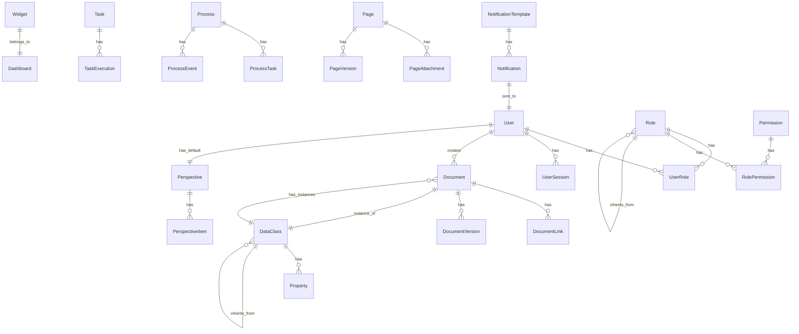

# Business Domain Model

## Overview
This document describes the core business entities, their relationships, and business rules that govern the Orienteer platform. The domain model is designed to be database-agnostic while capturing all essential business concepts.

## Core Domain Entities

### 1. User and Security Domain

#### User
**Purpose**: Represents a system user with authentication and profile information.

**Attributes**:
- `id` (UUID): Unique identifier
- `username` (String, unique, required): Login username
- `email` (String, unique, required): User email address
- `passwordHash` (String): Encrypted password
- `firstName` (String): User's first name
- `lastName` (String): User's last name
- `active` (Boolean): Account active status
- `emailVerified` (Boolean): Email verification status
- `locale` (String): Preferred language/locale
- `timezone` (String): User's timezone
- `createdDate` (DateTime): Account creation timestamp
- `lastLoginDate` (DateTime): Last successful login
- `failedLoginAttempts` (Integer): Failed login counter
- `lockedUntil` (DateTime): Account lock expiration

**Relationships**:
- Has many `UserRole` (many-to-many with Role)
- Has many `UserSocialAccount` (one-to-many)
- Has one `Perspective` (default UI perspective)
- Has many `UserSession` (active sessions)
- Has many `UserPreference` (settings)

**Business Rules**:
- Username must be at least 3 characters
- Email must be valid format
- Password must meet complexity requirements
- Account locks after 5 failed login attempts
- Email verification required for certain operations

#### Role
**Purpose**: Defines a set of permissions and access rights.

**Attributes**:
- `id` (UUID): Unique identifier
- `name` (String, unique, required): Role name
- `description` (String): Role description
- `active` (Boolean): Role active status
- `system` (Boolean): System-defined role flag
- `priority` (Integer): Role precedence for conflicts

**Relationships**:
- Has many `UserRole` (many-to-many with User)
- Has many `RolePermission` (many-to-many with Permission)
- Has many `Role` (parent roles for inheritance)
- Has one `Perspective` (default perspective for role)

**Business Rules**:
- System roles cannot be deleted
- Role inheritance creates permission union
- Higher priority roles override lower ones

#### Permission
**Purpose**: Represents a specific access right or capability.

**Attributes**:
- `id` (UUID): Unique identifier
- `resource` (String, required): Resource identifier
- `action` (Enum): CREATE, READ, UPDATE, DELETE, EXECUTE
- `scope` (Enum): GLOBAL, CLASS, DOCUMENT, PROPERTY
- `conditions` (JSON): Additional access conditions

**Relationships**:
- Has many `RolePermission` (many-to-many with Role)

**Business Rules**:
- Permissions are evaluated hierarchically
- Document-level overrides class-level
- Explicit deny overrides allow

### 2. Data Model Domain

#### DataClass
**Purpose**: Represents a data entity type (similar to a database table).

**Attributes**:
- `id` (UUID): Unique identifier
- `name` (String, unique, required): Class name
- `displayName` (Map<String, String>): Localized display names
- `description` (Map<String, String>): Localized descriptions
- `abstract` (Boolean): Abstract class flag
- `system` (Boolean): System class flag
- `icon` (String): Icon identifier
- `color` (String): UI color code
- `defaultOrderBy` (String): Default sort expression
- `createdDate` (DateTime): Creation timestamp
- `modifiedDate` (DateTime): Last modification

**Relationships**:
- Has many `Property` (one-to-many)
- Has many `DataClass` (parent classes for inheritance)
- Has many `ClassIndex` (indexes)
- Has many `ClassHook` (lifecycle hooks)
- Has many `Document` (instances)

**Business Rules**:
- Class names must be unique
- Abstract classes cannot have direct instances
- System classes have restricted modifications
- Inheritance depth limited to 5 levels

#### Property
**Purpose**: Represents a field/attribute of a DataClass.

**Attributes**:
- `id` (UUID): Unique identifier
- `name` (String, required): Property name
- `displayName` (Map<String, String>): Localized names
- `description` (Map<String, String>): Localized descriptions
- `type` (Enum): STRING, INTEGER, DECIMAL, BOOLEAN, DATE, DATETIME, LINK, EMBEDDED, COLLECTION, MAP, BINARY
- `required` (Boolean): Required field flag
- `unique` (Boolean): Unique constraint flag
- `indexed` (Boolean): Index flag
- `readonly` (Boolean): Read-only flag
- `defaultValue` (String): Default value expression
- `min` (String): Minimum value/length
- `max` (String): Maximum value/length
- `pattern` (String): Validation regex pattern
- `order` (Integer): Display order

**Relationships**:
- Belongs to `DataClass` (many-to-one)
- Has one `DataClass` (for LINK type - target class)
- Has one `Property` (for inverse links)

**Business Rules**:
- Property names unique within class
- Type changes restricted for existing data
- Required properties need migration plan
- Circular references prevented

#### Document
**Purpose**: Represents an instance of a DataClass (similar to a database row).

**Attributes**:
- `id` (UUID): Unique identifier
- `version` (Integer): Optimistic lock version
- `createdDate` (DateTime): Creation timestamp
- `createdBy` (UUID): Creator user ID
- `modifiedDate` (DateTime): Last modification
- `modifiedBy` (UUID): Modifier user ID
- `data` (JSON): Property values

**Relationships**:
- Belongs to `DataClass` (many-to-one)
- Has many `DocumentLink` (relationships to other documents)
- Has many `DocumentVersion` (version history)
- Has many `DocumentAttachment` (file attachments)

**Business Rules**:
- Required properties must have values
- Unique constraints enforced
- Type validation on property values
- Referential integrity for links
- Version increments on update

### 3. User Interface Domain

#### Perspective
**Purpose**: Defines a customized UI perspective/workspace.

**Attributes**:
- `id` (UUID): Unique identifier
- `name` (String, required): Perspective name
- `alias` (String, unique): URL-friendly identifier
- `icon` (String): Icon class
- `description` (Map<String, String>): Localized descriptions
- `homeUrl` (String): Landing page URL
- `footer` (String): Custom footer HTML
- `features` (Set<String>): Enabled feature flags
- `active` (Boolean): Active status

**Relationships**:
- Has many `PerspectiveItem` (menu items)
- Has many `User` (users with this default)
- Has many `Role` (roles with this default)

**Business Rules**:
- At least one perspective must be active
- Alias must be URL-safe
- Features validated against available modules

#### Widget
**Purpose**: Represents a dashboard widget component.

**Attributes**:
- `id` (UUID): Unique identifier
- `typeId` (String, required): Widget type identifier
- `title` (Map<String, String>): Localized titles
- `icon` (String): Icon class
- `description` (Map<String, String>): Descriptions
- `configuration` (JSON): Widget-specific settings
- `domain` (String): Target entity/class
- `tab` (String): Dashboard tab
- `order` (Integer): Display order
- `width` (Integer): Grid width
- `height` (Integer): Grid height
- `minimizable` (Boolean): Can minimize
- `maximizable` (Boolean): Can maximize
- `closable` (Boolean): Can close
- `refreshable` (Boolean): Can refresh

**Relationships**:
- Belongs to `Dashboard` (many-to-one)
- Has many `WidgetSetting` (user customizations)

**Business Rules**:
- Widget type must be registered
- Configuration validated against schema
- Grid position conflicts resolved
- Maximum widgets per dashboard limited

### 4. Task and Process Domain

#### Task
**Purpose**: Represents a background or scheduled task.

**Attributes**:
- `id` (UUID): Unique identifier
- `name` (String, required): Task name
- `description` (String): Task description
- `type` (Enum): ONE_TIME, RECURRING, EVENT_TRIGGERED
- `status` (Enum): PENDING, RUNNING, COMPLETED, FAILED, CANCELLED
- `schedule` (String): Cron expression for recurring
- `nextRunTime` (DateTime): Next scheduled execution
- `lastRunTime` (DateTime): Last execution time
- `configuration` (JSON): Task parameters
- `retryCount` (Integer): Retry attempts
- `maxRetries` (Integer): Maximum retries
- `timeout` (Integer): Timeout in seconds

**Relationships**:
- Has many `TaskExecution` (execution history)
- Belongs to `User` (task owner)
- Has many `TaskDependency` (dependent tasks)

**Business Rules**:
- Schedule validation for cron expressions
- Timeout must be positive
- Retry count cannot exceed max retries
- Dependencies prevent circular references

#### Process
**Purpose**: Represents a business process workflow instance.

**Attributes**:
- `id` (UUID): Unique identifier
- `definitionId` (String, required): Process definition ID
- `name` (String): Instance name
- `status` (Enum): ACTIVE, SUSPENDED, COMPLETED, CANCELLED
- `startTime` (DateTime): Process start time
- `endTime` (DateTime): Process end time
- `variables` (JSON): Process variables
- `currentActivity` (String): Current activity ID

**Relationships**:
- Has many `ProcessTask` (human tasks)
- Has many `ProcessEvent` (audit trail)
- Belongs to `User` (initiator)

**Business Rules**:
- Definition must exist and be active
- Variables validated against definition
- State transitions follow BPMN rules
- SLA monitoring for time constraints

### 5. Content Domain

#### Page
**Purpose**: Represents a content page or document.

**Attributes**:
- `id` (UUID): Unique identifier
- `title` (Map<String, String>): Localized titles
- `slug` (String, unique): URL slug
- `content` (Map<String, String>): Localized content (HTML)
- `summary` (Map<String, String>): Page summaries
- `status` (Enum): DRAFT, PUBLISHED, ARCHIVED
- `publishDate` (DateTime): Publication date
- `expiryDate` (DateTime): Content expiration
- `template` (String): Page template ID
- `metadata` (JSON): SEO and custom metadata

**Relationships**:
- Has many `PageAttachment` (files)
- Has many `Page` (child pages - hierarchy)
- Belongs to `User` (author)
- Has many `PageVersion` (version history)

**Business Rules**:
- Slug must be unique and URL-safe
- Published pages require title and content
- Expiry date must be after publish date
- Template changes may require content migration

### 6. Notification Domain

#### NotificationTemplate
**Purpose**: Defines reusable notification templates.

**Attributes**:
- `id` (UUID): Unique identifier
- `name` (String, unique, required): Template name
- `channel` (Enum): EMAIL, SMS, IN_APP, PUSH
- `subject` (String): Message subject template
- `body` (String): Message body template
- `variables` (Set<String>): Required variables
- `active` (Boolean): Template active status

**Relationships**:
- Has many `Notification` (sent notifications)

**Business Rules**:
- Variables must use valid syntax
- Channel-specific validation (email needs subject)
- Template testing before activation

#### Notification
**Purpose**: Represents a notification instance.

**Attributes**:
- `id` (UUID): Unique identifier
- `recipient` (String, required): Recipient address/ID
- `channel` (Enum): Delivery channel
- `subject` (String): Rendered subject
- `body` (String): Rendered body
- `status` (Enum): PENDING, SENT, DELIVERED, FAILED
- `scheduledTime` (DateTime): Send time
- `sentTime` (DateTime): Actual sent time
- `errorMessage` (String): Error details if failed
- `metadata` (JSON): Channel-specific data

**Relationships**:
- Belongs to `User` (recipient user)
- Belongs to `NotificationTemplate` (template used)
- Belongs to `Event` (triggering event)

**Business Rules**:
- Recipient validation per channel
- Retry logic for failed sends
- Rate limiting per recipient
- Unsubscribe compliance

## Cross-Cutting Concerns

### Audit Trail
All entities support audit logging with:
- Created date/time and user
- Modified date/time and user
- Change history tracking
- IP address logging for security events

### Localization
Multi-language support patterns:
- Localized string maps for user-facing text
- Locale-specific validation rules
- Date/time/number formatting per locale
- Translation key management

### Versioning
Content versioning capabilities:
- Major/minor version numbering
- Draft vs. published states
- Version comparison and rollback
- Concurrent editing detection

### Security
Security patterns across entities:
- Row-level security via permissions
- Field-level access control
- Data encryption for sensitive fields
- Audit logging for compliance

### Multi-Tenancy
Tenant isolation patterns:
- Tenant ID on all entities
- Database-level isolation option
- Schema-level isolation option
- Cross-tenant data sharing controls

## Entity Relationship Diagram

## Business Rules Summary

### Data Integrity Rules
1. Referential integrity enforced for all relationships
2. Cascade delete rules configurable per relationship
3. Orphaned records automatically cleaned up
4. Circular reference prevention

### Validation Rules
1. Type validation for all property values
2. Format validation for emails, URLs, etc.
3. Range validation for numeric values
4. Pattern validation for string formats
5. Cross-field validation support

### State Transition Rules
1. Document lifecycle: Draft → Published → Archived
2. Task lifecycle: Pending → Running → Completed/Failed
3. Process lifecycle: Active → Suspended → Completed/Cancelled
4. User lifecycle: Pending → Active → Inactive

### Business Process Rules
1. Workflow tasks assigned based on roles
2. Escalation for overdue tasks
3. Parallel and sequential task execution
4. Conditional branching based on data

### Security Rules
1. Authentication required for all operations except public pages
2. Authorization checked at multiple levels
3. Sensitive data encrypted at rest
4. Session timeout after inactivity
5. Password expiration policies

This domain model provides a complete foundation for reimplementing Orienteer's business logic in any technology stack while maintaining functional equivalence.